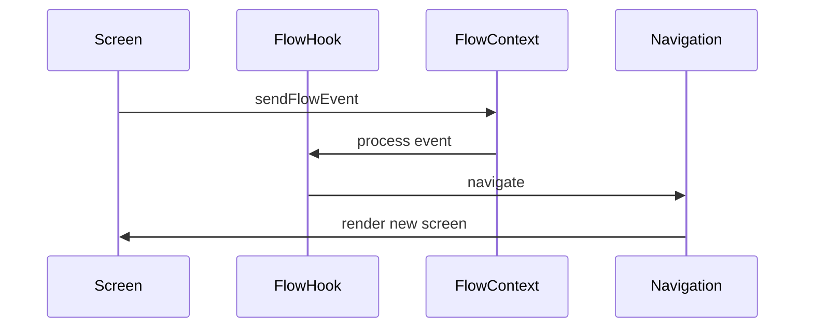

# Flow Lifecycle

## Flow States

A flow goes through several states during its lifecycle:

1. **Initialization**
   - Flow is registered in the system
   - Flow component is mounted
   - Flow hook is initialized

2. **Active**
   - Flow is the current active flow
   - Receives and processes events from screens
   - Manages navigation and state transitions
   - Cleanup flow after handling

4. **Completed**
   - Flow has finished successfully
   - Resources are cleaned up
   - Control returns to parent flow or main navigation

5. **Aborted**
   - Flow was interrupted or failed
   - Cleanup is performed
   - User is returned to a safe state

## Event Flow



## Example Implementation

```typescript
function useFlowB() {
  // 1. Initialization
  useEffect(() => {
    if (currentFlow === flowName) {
      handleStart();
    }
  }, [currentFlow]);

  // 2. Event Processing
  useEffect(() => {
    if (currentFlow !== flowName) {
      return; // Flow is not active
    }

    if ((flowEventSource === "") || (flowEventAction === "")) {
      return; // No event to process
    }
    
    const handler = flowHandlers[flowEventSource];
    if (handler) {
      handler();
      completeFlowEvent(); // Important to cleanup flow event
    }
  }, [currentFlow, flowEventSource, flowEventAction]);

  // 3. Flow Abortion
  useEffect(() => {
    if (currentFlow !== flowName) {
      return;
    }

    if (shouldAbortFlow()) {
      completeFlow(flowName);
      return;
    }
  }, [navigationScreen, currentFlow]);

  // 4. Cleanup
  const handleComplete = () => {
    console.log(`${currentFlow}/handleComplete`); 
    const popToAction = StackActions.popTo("MainTabs", { 
      screen: "ProfileScreen"
    });
    navigation.dispatch(popToAction);
    completeFlow(flowName);
  };

  return {
    sheetARef,
    flowName,
  }
}
```

## State Transitions

1. **Start Flow**
   ```typescript
   startFlow('flowName');
   ```

2. **Send Events from screen / bottom sheet**
   ```typescript
   sendFlowEvent({
     source: 'ScreenName', // Could be BottomSheet name
     action: 'actionName'
   });
   ```

3. **Complete Flow**
   ```typescript
   completeFlow('flowName');
   ```

### Flow event handlers

Check src/flows/Flow*/useFlow* hooks as examples

1. ** Write handlers for each  screen/bottom sheet
   ```typescript

   const handlers = {
      'ScreenA': hand
   }


## Best Practices

1. **Initialization**
   - Keep initialization logic minimal
   - Use `handleStart` for flow-specific setup
   - Keep screen where flow start in flow handlers to avoid flow abort
   - Initialize refs and state in the hook

2. **Event Handling**
   - To avoid 
   - Clean up event state after processing

3. **Cleanup**
   - Always clean up resources in `handleComplete`
   - Handle both success and failure cases
   - Return user to a safe navigation state

4. **Error Handling**
   - Implement proper error boundaries
   - Provide fallback navigation paths
   - Log errors for debugging 